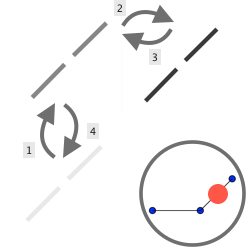

************
User Study A
************

Introduction
============
This reports describes briefly the procotol followed and presents the data collected with their results. This user study aims to compare different sets of tactile signals in order to evaluate which would be the most suited for graph exploration.
Two sets of tactile signals has been developed: one is purely mapping what is under the device (M) when the second adds some guidance (G). These two sets - M and G, are the result of multiple enhancement after each iteration where the users have reported their struggles and where we have observed their difficulties in adopting these sets of tactile signals.

Hypothesis
==========
We are looking for an answer on the best set of tactile signals, in order to prove or disprove the usability of one we will start with the following statement. With the end results, we would then be able to confirm or deny our hypothesis.

1. The set G is more **efficient** than M.
2. The set G is more **satisfying** than M.

Interactions
============

Mapping set of tactile signals
------------------------------

The behavior is following these rules:

- When the device is pointing to a node, the actuator uplifted indicate the connexion with other node. The other actuators are left down.
- When the device is pointing to a link between two nodes, the actuators corresponding to the direction of this link are up, the others down.
- When the device is pointing nothing, the actuators are left down.

.. figure:: ressources/m_on_node.png
   :height: 100px
   :width: 200px
   :align: center

Guidance set of tactile signals
-------------------------------

The behavior is following the same behavior as the Mapping one, but adds a guidance when near link.

- When the device is near a link, the actuator going towards that link is oscilatting up and down. The rest of the actuators are left down.

.. figure:: ressources/g_near_link.png
   :height: 100px
   :width: 200px
   :align: center

Protocol
========

The subjects were informed about the HaptiQ project and the purpose of this evaluation. They were given a disclaimer to read and sign, before starting the experiment.
A quick form was then given to check out any familiarities with haptic devices. Before the eye mask is put, they were told that they could leave the experiment at any given time without justification and they also remove the mask if they were feeling uncomfortable.

Then they were told to manipulate the device in order to feel it without tactile signal and also it allowed them to get a mental representation of the frame that is used for tracking the position. When done, a training network is loaded with a the one of the interaction. I then describe the set of tactile signals before letting the exploration. I emphasize on the importance that this is for understanding the way the interaction is working, so I encouraged questions. When ready, I loaded a second graph that is used as a blank test; we then agreed on the way the subject is more familiar describing the network eg. "central node with one connection to the North and one to the South-East". I then told them that there would be six similar tasks to perform as fast as possible.

The graphs used were always a central node in the center of the frame with one, two or three connections around it. These graphs are generated randomly given the number of nodes. The six tasks were a random order of the following graphs:

- one graph with one connection
- three graphs with two connections
- two graphs with three connections

.. figure:: ressources/possible_graphs.png
   :height: 100px
   :width: 200px
   :align: center

They were then asked to fill out a SUS questionnaire and were invited to share their remarks.
When both of the interaction technique were evaluated, they were then asked to say which would be the most convenient one.

Data
====

t is for time (in ms) and a is for answer (true or false)
Score is 1 for when the set is preferred, 0 otherwise
Ratio is time inside the network on the total time of the experiment (1 means always on network)
Distance is the total distance traveled with the device (in px)

On subjects
-----------

+---------+------+-----+--------------+-------------------+-----------+
| Subject | Date | Age | Right handed | Haptic experience | Frequency |
+=========+======+=====+==============+===================+===========+
| EB      |      |     |              |                   |           |
+---------+------+-----+--------------+-------------------+-----------+

On set M
--------

+---------+-------+-------+-------+-------+-------+-------+-------+-------+-------+-------+-------+-------+-------+-------+-------+----------+---------+--------------------+
| Subject | t_M-1 | a_M-1 | t_M-2 | a_M-2 | t_M-2 | a_M-2 | t_M-2 | a_M-2 | t_M-3 | a_M-3 | t_M-3 | a_M-3 | M-SUS | Score | Ratio | Distance | Remarks | Experiment remarks |
+=========+=======+=======+=======+=======+=======+=======+=======+=======+=======+=======+=======+=======+=======+=======+=======+==========+=========+====================+
| EB      |       |       |       |       |       |       |       |       |       |       |       |       |       |       |       |          |         |                    |
+---------+-------+-------+-------+-------+-------+-------+-------+-------+-------+-------+-------+-------+-------+-------+-------+----------+---------+--------------------+

On set G
--------

+---------+-------+-------+-------+-------+-------+-------+-------+-------+-------+-------+-------+-------+-------+-------+-------+----------+---------+--------------------+
| Subject | t_G-1 | a_G-1 | t_G-2 | a_G-2 | t_G-2 | a_G-2 | t_G-2 | a_G-2 | t_G-3 | a_G-3 | t_G-3 | a_G-3 | G-SUS | Score | Ratio | Distance | Remarks | Experiment remarks |
+=========+=======+=======+=======+=======+=======+=======+=======+=======+=======+=======+=======+=======+=======+=======+=======+==========+=========+====================+
| EB      |       |       |       |       |       |       |       |       |       |       |       |       |       |       |       |          |         |                    |
+---------+-------+-------+-------+-------+-------+-------+-------+-------+-------+-------+-------+-------+-------+-------+-------+----------+---------+--------------------+

Results
=======

TODO