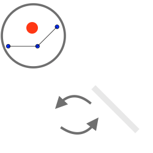
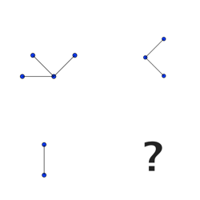

************
User Study A
************

Introduction
============
This reports describes briefly the procotol followed and presents the data collected with their results. This user study aims to compare different sets of tactile signals in order to evaluate which would be the most suited for graph exploration. Two sets of tactile signals has been developed: one is purely mapping what is under the device (M) when the second adds some guidance (G). These two sets - M and G, are the result of multiple enhancement after each iteration where the users have reported their struggles and where we have observed their difficulties in adopting these sets of tactile signals.

Hypothesis
==========
We are looking for an answer on the best set of tactile signals, in order to prove or disprove the usability of one we will start with the following statement. With the end results, we would then be able to confirm or deny our hypothesis.

1. The set G is more **efficient** than M.
2. The set G is more **satisfying** than M.

Interactions
============

Mapping set of tactile signals
------------------------------

The behavior is following these rules:

- When the device is pointing to a node, the actuator uplifted indicate the connexion with other node. The other actuators are left down.
- When the device is pointing to a link between two nodes, the actuators corresponding to the direction of this link are up, the others down.
- When the device is pointing nothing, the actuators are left down.

.. figure:: ressources/m_on_node.png
   :height: 250px
   :align: center
   :width: 250px

   Figure 1: Tactile signal when device is pointing to a node

.. figure:: ressources/m_on_link.png
   :height: 250px
   :align: center
   :width: 250px
   
   Figure 2: Tactile signal when device is pointing to a link

Guidance set of tactile signals
-------------------------------

The behavior is following the same behavior as the Mapping one, but adds a guidance when near link.

- When the device is near a link, the actuator going towards that link is oscilatting up and down. The rest of the actuators are left down.

   Tactile signal when device is near a link

Protocol
========

The subjects were informed about the HaptiQ project and the purpose of this evaluation. They were given a disclaimer to read and sign, before starting the experiment. A quick form was then given to check out any familiarities with haptic devices. Before the eye mask is put, they were told that they could leave the experiment at any given time without justification and they also remove the mask if they were feeling uncomfortable.

Then they were told to manipulate the device in order to feel it without tactile signal and also it allowed them to get a mental representation of the frame that is used for tracking the position. When done, a training network is loaded with one of the mappings. I then describe the set of tactile signals before letting the exploration. I emphasize on the importance that this is for understanding the way the interaction is working, so I encouraged questions. When ready, I loaded a second graph that is used as a blank test; we then agreed on the way the subject is more familiar describing the network eg. "central node with one connection to the North and one to the South-East". I then told them that there would be six similar tasks to perform as fast as possible.

The graphs used were always a central node in the center of the frame with one, two or three connections around it. These graphs are generated randomly given the number of nodes. The six tasks were a random order of the following graphs:

- one graph with one connection
- three graphs with two connections
- two graphs with three connections

They were then asked to fill out a SUS questionnaire and were invited to share their remarks.
When both of the interaction technique were evaluated, they were then asked to say which would be the most convenient one.

Data
====

t is for time (in s) and a is for answer (true or false)

Score is 1 for when the set is preferred, 0 otherwise
Ratio is time inside the network on the total time of the experiment (1 means always on network)
Distance is the total distance traveled with the device (in px)

On subjects
-----------

+---------+------------------+-----+--------+-----------------------------------+-------------------+-----------+
| Subject | Date             | Age | gender | Right handed                      | Haptic experience | Frequency |
+=========+==================+=====+========+===================================+===================+===========+
| EB      | 06/08/2014 17:44 | 22  | F      | Yes                               | Little            | Rare      |
+---------+------------------+-----+--------+-----------------------------------+-------------------+-----------+
| HX      | 14/08/2015 13:45 | 27  | M      | Yes                               | None              | /         |
+---------+------------------+-----+--------+-----------------------------------+-------------------+-----------+
| AL      | 17/08/2015 18:41 | 24  | M      | No, but uses right hand for mouse | Little            | Rare      |
+---------+------------------+-----+--------+-----------------------------------+-------------------+-----------+
| SB      | 19/08/2015 13:50 | 25  | F      | No, but uses right hand for mouse | None              | /         |
+---------+------------------+-----+--------+-----------------------------------+-------------------+-----------+
| AD      | 25/08/2015 9:24  | 26  | M      | Yes                               | Moderate          | Rare      |
+---------+------------------+-----+--------+-----------------------------------+-------------------+-----------+
| SD      | 25/08/2015 19:10 | 24  | F      | Yes                               | None              | /         |
+---------+------------------+-----+--------+-----------------------------------+-------------------+-----------+

Data
----

Conf: the number of links
Trial: the order for which this configuration has been tried (between other configurations)
T{M, G}: time before giving answer with interaction {M, G} divided by segment
R{M, G}: ratio of time spent on graph out of the total time
D{M, G}: distance traveled before giving answer

+---------+-----+------+-------+----------+----------+----------+----------+-----------+-----------+
| Subject | Obs | Conf | Trial | TM       | TG       | RM       | RG       | DM        | DG        |
+=========+=====+======+=======+==========+==========+==========+==========+===========+===========+
| EB      | /   | 1    | 1     | 111.0    | 50       | 0.29     | 0.26     | 1974.2    | 619.2     |
| EB      | /   | 2    | 1     | 37.0     | 31.5     | 0.32     | 0.86     | 802.9     | 480.4     |
| EB      | /   | 2    | 2     | 16.5     | 40       | 0.96     | 0.64     | 354.5     | 579.8     |
| EB      | /   | 2    | 3     | 52.5     | 43       | 0.61     | ?        | 1142.0    | ?         |
| EB      | /   | 3    | 1     | 13.0     | 10       | 0.67     | 0.95     | 361.8     | 304.0     |
| EB      | /   | 3    | 2     | 8.3      | NG(16.3) | 0.75     | NG(0.87) | 218.8     | NG(409.1) |
+---------+-----+------+-------+----------+----------+----------+----------+-----------+-----------+
| HX      | /   | 1    | 1     | 43.0     | 51       | 0.79     | 0.71     | 990.5     | 566.9     |
| HX      | /   | 2    | 1     | 38.5     | NG(22)   | 0.54     | NG(?)    | 2076.6    | NG(?)     |
| HX      | /   | 2    | 2     | 26.0     | 21.5     | 0.58     | 0.61     | 753.3     | 459.7     |
| HX      | /   | 2    | 3     | 19       | 29.5     | 0.47     | 0.58     | 736.2     | 477.8     |
| HX      | /   | 3    | 1     | 12.3     | 25.7     | 0.22     | 0.46     | 626.7     | 965.9     |
| HX      | /   | 3    | 2     | 19.7     | 33.3     | 0.36     | 0.57     | 1032.2    | 1003.4    |
+---------+-----+------+-------+----------+----------+----------+----------+-----------+-----------+
| AL      | /   | 1    | 1     | 45       | 41.0     | 0.53     | 0.30     | 404.4     | 601.0     |
| AL      | /   | 2    | 1     | 12.5     | 8.5      | 0.30     | 0.26     | 266.0     | 175.2     |
| AL      | /   | 2    | 2     | 19.5     | 36.0     | 0.63     | 0.45     | 350.4     | 617.8     |
| AL      | /   | 2    | 3     | 29.0     | 18.7     | 0.80     | 0.57     | 664.5     | 419.7     |
| AL      | /   | 3    | 1     | NG(22)   | 18.7     | NG(?)    | 0.57     | NG(592.9) | 582.9     |
| AL      | /   | 3    | 2     | 25.0     | NG(19.7) | 0.61     | NG(0.64) | 923.4     | NG(717)   |
+---------+-----+------+-------+----------+----------+----------+----------+-----------+-----------+
| SD      | /   | 1    | 1     | 79.0     | 24.0     | 0.37     | 0.38     | 3004.1    | 417.0     |
| SD      | /   | 2    | 1     | 32.0     | 20.5     | 0.55     | 0.90     | 812.8     | 460.1     |
| SD      | /   | 2    | 2     | 25.5     | 16.5     | 0.75     | 0.69     | 549.6     | 305.3     |
| SD      | /   | 2    | 3     | 28.0     | 21.5     | 0.56     | 0.44     | 889.5     | 459.7     |
| SD      | /   | 3    | 1     | 33.3     | 20.7     | 0.73     | 0.66     | 1188.8    | 564.1     |
| SD      | /   | 3    | 2     | 23.0     | NG(22.7) | 0.66     | NG(0.43) | 1038.0    | NG(459.7) |
+---------+-----+------+-------+----------+----------+----------+----------+-----------+-----------+
| AD      | /   | 1    | 1     | 99       | 130      | 0.31     | 0.41     | 5215.2    | 433.5     |
| AD      | /   | 2    | 1     | NG(25.5) | 38.5     | NG(0.39) | 0.59     | NG(536.8) | 710.6     |
| AD      | /   | 2    | 2     | 18.0     | 20.5     | 0.15     | 0.33     | 406.2     | 433.5     |
| AD      | /   | 2    | 3     | 22.5     | 24       | 0.57     | 0.64     | 417.7     | 474.9     |
| AD      | /   | 3    | 1     | NG(10.3) | 56.7     | NG(0.20) | 0.49     | NG(530.7) | 1121.4    |
| AD      | /   | 3    | 2     | NG(19)   | 33.3     | NG(0.69) | 0.25     | NG(838.4) | 1494.1    |
+---------+-----+------+-------+----------+----------+----------+----------+-----------+-----------+
| DS      | /   | 1    | 1     | 49.0     | 58.0     | 0.66     | 0.60     | 324.5     | 408.5     |
| DS      | /   | 2    | 1     | NG(26.5) | 33.0     | NG(0.38) | 0.38     | NG(288.6) | 466.9     |
| DS      | /   | 2    | 2     | 24.0     | 23.5     | ?        | 0.56     | 407.2     | 500.5     |
| DS      | /   | 2    | 3     | NG(14.0) | 10.0     | NG(?)    | ?        | NG(511.0) | 267.8     |
| DS      | /   | 3    | 1     | 9.7      | NG(17.0) | 0.61     | NG(0.27) | 181.8     | NG(307.7) |
| DS      | /   | 3    | 2     | 21.3     | 12.0     | 0.89     | 0.38     | 542.4     | 400.8     |
+---------+-----+------+-------+----------+----------+----------+----------+-----------+-----------+
| Subject | Obs | Conf | Trial | TM       | TG       | RM       | RG       | DM        | DG        |
+---------+-----+------+-------+----------+----------+----------+----------+-----------+-----------+

Feedbacks
---------

SUS score is out of 100
SM and SG are 1 for being picked first, 0 if not

+---------+------+------+----+----+
| Subject | SUSM | SUSG | SM | SG |
+=========+======+======+====+====+
| EB      | 85   | 92.5 | 0  | 1  |
| HX      | 75   | 95   | 0  | 1  |
| AL      | 67.5 | 77.5 | 0  | 1  |
| SD      | 77.5 | 92.5 | 0  | 1  |
| AD      | 47.5 | 75   | 0  | 1  |
| DS      | 77.5 | 87.5 | 0  | 1  |
+---------+------+------+----+----+

Remarks
-------

On interaction M
^^^^^^^^^^^^^^^^

- always felt lost, needed to perform a search pattern x3
- not useful
- thought sometimes it was not working, because of lack of interaction
- lack of contrast

On interaction G
^^^^^^^^^^^^^^^^

- good tactile feeling
- with training could be expert x3
- less workload
- covers everything needed

General remarks
^^^^^^^^^^^^^^^

- confusing horizontal lines with diagonal ones x4
- tiring (cannot rest your hand)
- needed some time to learn how to use the tactons x3
- not easy to recognize directions x2
- needed to check one by one all the actuators x2
- it felt shy, so I needed to adapt to feel it properly x2
- device felt fragile
- needed to raise and land hand to avoid stucking actuators
- too much friction for moving
- felt like orientation drifting
- sound was helping (conforting my own track because of rythm, easier to differentiate from node to link) x4
- sensitivity felt uneven x2
- device is too big x3
- oscillation makes it intuitive to follow
- interactions well thought
- box is cute

Suggestions
^^^^^^^^^^^

- could have a cover x2
- better to have a horizontal reference x2
- having a multi-point interactions (like drawing with the pen on the hand)
- change tactile sensation of diagonals
- oscilations should be faster
- would be easier to differentiate node and link with a vibror
- for an optimal training, it would be best to have M first and then G

Results
=======

TODO